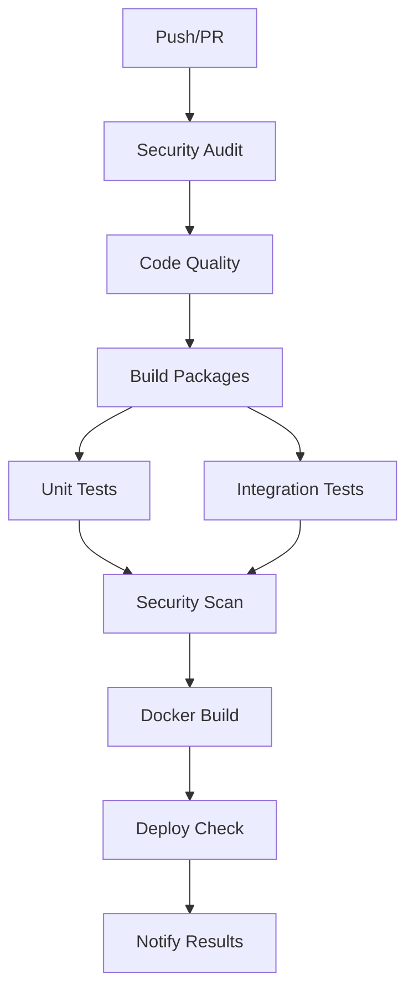

# HandoverKey CI/CD Pipeline

This directory contains the complete CI/CD pipeline configuration for HandoverKey, ensuring code quality, security, and reliable deployments.

## 🚀 Pipeline Overview

### Workflows

1. **[CI Pipeline](.github/workflows/ci.yml)** - Main continuous integration
2. **[PR Quality Checks](.github/workflows/pr-checks.yml)** - Pull request validation
3. **[Release Pipeline](.github/workflows/release.yml)** - Automated releases
4. **[CodeQL Security Analysis](.github/workflows/codeql.yml)** - Security scanning

### Templates

- **[Pull Request Template](PULL_REQUEST_TEMPLATE.md)** - Standardized PR format
- **[Bug Report](ISSUE_TEMPLATE/bug_report.yml)** - Bug reporting template
- **[Feature Request](ISSUE_TEMPLATE/feature_request.yml)** - Feature request template
- **[Security Report](ISSUE_TEMPLATE/security_report.yml)** - Security vulnerability reporting

## 🔄 CI Pipeline Flow



### Pipeline Stages

#### 1. **Security Audit**
- Dependency vulnerability scanning
- High-severity vulnerability blocking
- Security best practices validation

#### 2. **Code Quality**
- ESLint code linting
- TypeScript type checking
- Code formatting validation
- Style guide compliance

#### 3. **Build Packages**
- Monorepo package building
- Artifact generation
- Build artifact caching

#### 4. **Testing**
- **Unit Tests**: Individual package testing
- **Integration Tests**: Database and API testing
- **E2E Tests**: Full application testing (PR only)
- **Performance Tests**: Load testing (labeled PRs)

#### 5. **Security Scanning**
- Trivy vulnerability scanning
- SARIF report generation
- Security alert integration

#### 6. **Docker Build**
- Multi-platform image building
- Container security scanning
- Image vulnerability assessment

## 📋 PR Quality Checks

### Automated Validations

- **PR Title**: Conventional commit format validation
- **PR Description**: Required sections and minimum length
- **Breaking Changes**: API compatibility checking
- **Code Coverage**: Minimum coverage threshold
- **Dependencies**: New dependency analysis
- **Security Review**: Sensitive code pattern detection
- **Documentation**: Doc update requirements

### Required Sections in PR Description

```markdown
## Changes
<!-- Describe what was changed -->

## Testing
<!-- Describe how it was tested -->
```

## 🚀 Release Pipeline

### Trigger Methods

1. **Git Tags**: Push tags matching `v*` pattern
2. **Manual Dispatch**: Workflow dispatch with version input

### Release Process

1. **Validate Release**: Version format and changelog validation
2. **Full Test Suite**: Comprehensive testing across Node.js versions
3. **Build Images**: Multi-platform Docker image creation
4. **Security Scan**: Release image vulnerability scanning
5. **Generate Changelog**: Automated changelog generation
6. **Create Release**: GitHub release with artifacts
7. **Deploy**: Production deployment (non-prerelease)

### Version Format

- **Stable**: `v1.0.0`, `v1.2.3`
- **Prerelease**: `v1.0.0-beta.1`, `v2.0.0-rc.1`

## 🔒 Security Features

### Automated Security Scanning

- **CodeQL**: Static analysis for security vulnerabilities
- **Trivy**: Container and filesystem vulnerability scanning
- **Dependency Scanning**: NPM audit and vulnerability detection
- **Secret Scanning**: Credential and API key detection

### Security Reporting

- **Private Reporting**: GitHub's private vulnerability reporting
- **Public Issues**: Non-sensitive security improvements
- **SARIF Integration**: Security findings in GitHub Security tab

## 🛡️ Branch Protection

### Main Branch Requirements

- **2 Required Approvals**
- **Code Owner Review** (for crypto/security changes)
- **All Status Checks** must pass
- **Signed Commits** required
- **Linear History** enforced

### Status Checks Required

- Security Audit
- Code Quality
- Build Packages
- Unit Tests (all packages)
- Integration Tests
- Security Scan
- PR Quality Validation
- CodeQL Analysis

## 📊 Monitoring and Notifications

### Success Indicators

- ✅ All tests passing
- ✅ Security scans clean
- ✅ Code quality standards met
- ✅ Build artifacts generated

### Failure Handling

- ❌ Detailed error reporting
- 📧 Team notifications
- 🔄 Automatic retry for flaky tests
- 📋 Clear remediation steps

## 🔧 Local Development

### Running CI Checks Locally

```bash
# Install dependencies
npm ci

# Run linting
npm run lint

# Run type checking
npm run type-check

# Run tests
npm run test

# Run security audit
npm run security:audit

# Build all packages
npm run build
```

### Pre-commit Hooks

Consider setting up pre-commit hooks to run basic checks:

```bash
# Install husky for git hooks
npm install --save-dev husky

# Set up pre-commit hook
npx husky add .husky/pre-commit "npm run lint && npm run type-check"
```

## 🚀 Deployment Environments

### Environment Progression

1. **Development** - Local development with Docker Compose
2. **Staging** - PR preview deployments
3. **Production** - Stable releases only

### Environment Variables

Each environment requires specific configuration:

```bash
# Development
NODE_ENV=development
DB_HOST=localhost
API_URL=http://localhost:3001

# Staging
NODE_ENV=staging
DB_HOST=staging-db.example.com
API_URL=https://staging-api.handoverkey.com

# Production
NODE_ENV=production
DB_HOST=prod-db.example.com
API_URL=https://api.handoverkey.com
```

## 📈 Performance Monitoring

### Metrics Tracked

- **Build Time**: Pipeline execution duration
- **Test Coverage**: Code coverage percentage
- **Security Score**: Vulnerability count and severity
- **Bundle Size**: Application bundle size changes

### Performance Budgets

- **Build Time**: < 10 minutes
- **Test Coverage**: > 80%
- **Critical Vulnerabilities**: 0
- **Bundle Size**: < 2MB (web app)

## 🔄 Continuous Improvement

### Regular Reviews

- **Weekly**: Pipeline performance and failure analysis
- **Monthly**: Security scan results and dependency updates
- **Quarterly**: Pipeline optimization and tool updates

### Metrics and KPIs

- **Pipeline Success Rate**: Target > 95%
- **Mean Time to Recovery**: Target < 30 minutes
- **Security Response Time**: Target < 24 hours
- **Deployment Frequency**: Target daily (for non-breaking changes)

## 🆘 Troubleshooting

### Common Issues

1. **Test Failures**: Check test logs and database connectivity
2. **Build Failures**: Verify dependencies and TypeScript errors
3. **Security Failures**: Review vulnerability reports and update dependencies
4. **Docker Issues**: Check Dockerfile syntax and base image updates

### Getting Help

- **Pipeline Issues**: Check workflow logs and status checks
- **Security Concerns**: Use private vulnerability reporting
- **Feature Requests**: Use the feature request template
- **General Questions**: Create a discussion or issue

---

This CI/CD pipeline ensures that HandoverKey maintains the highest standards of code quality, security, and reliability while enabling rapid and safe development cycles. 🚀